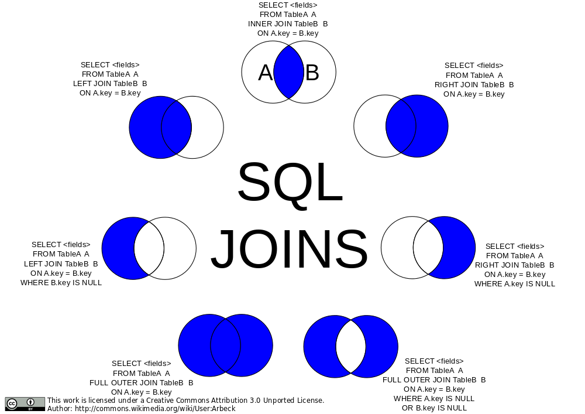

# One to Many Joins

> Outline :

- [ ] .
- [ ] .
- [ ] .
- [ ]

---

## Content

### 220. Data is Messy

- What Mean `Real world Data` si `Messy` and `Interrelated` ?
- Make a Book_shop Data Base Use mermaid to draw graph to it.
- What mean RelationShip ?

### 221. Relationships Basics

- What Types of RelationShip ?
  1. One to One Relationship
  2. One to Many Relationship
  3. Many to one Relationship
  4. Many to Many Relationship
- What types of Properties Within RelationShip ?
  1. Cardinality
  2. Complexity
  3. Relationship Attributes
  4. Optionality
  5. Identification
  6. Constraint Types

### 222. One to Many Relationship

- Why `1:Many` is the most common relationship ?
- Make a Customers & Orders relationShip Examples ?
- What is `Primary Key` and Why Need it show in Example ?
- What is `Foreign key` ?
  - is Real core of Relation in RDBs with `Primary key`
- What mean with `Schema` and types of `Schemas` ?
  - Physical Schema: How data is physically stored.
  - Logical Schema: How data is logically organized and related.
  - Conceptual Schema: The high-level view of the data model.
  - External Schema: Different views of the data for different users.
  - Data Schema: The overall structure of the database, including tables and relationships.

> More

### 223. Working with FOREIGN KEY

- what is `Forign key` ?
- make a 3 examples show the rules of create `forign key` ?

### 225. Cross Joins

- What is `Cross Join` ?
- Make an example for Cross Join ?

### 227. Inner Joins

- What is Inner Joins ?
- Make An Examples about `Inner Joins` ?

### 229. Inner Joins With Group By

- How to group inner joins with `group by` ?
- Make A 3 examples about using `group by` with inner joins ?

### 231. Left Join

- What is `left join` ?
- Make a 3 Examples about using `left join` ?

### 233. Left Join With Group By

- How to use left join with group by ?
- Make a 3 Examples about using `group by` with left joins ?
  - use this in Example `IFNULL(sum(amount), 0)`

### 235. Right Joins

- What is `Right Joins` ?
- Make an Examples about using `Right Joins` with right joins ?

### 237. On Delete Cascade

- What is `on Delete Casecade` ?
- Make an 3 Examples about using `On Delete Cascade` ?

---
