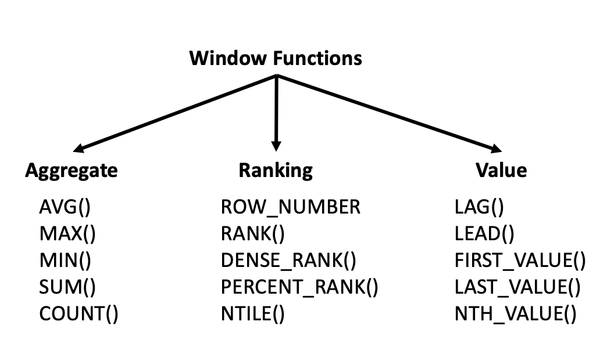
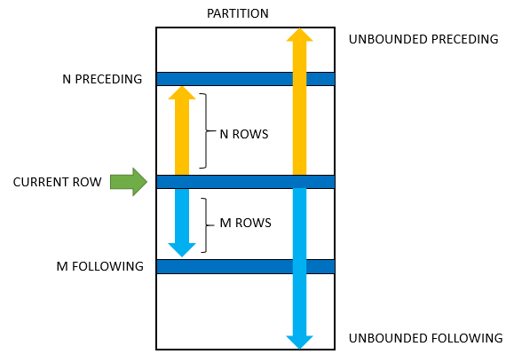

# Window Functions

## Table of Contents

1. [Introducing Window Functions](#275-introducing-window-functions) ✨
2. [Using OVER()](#276-using-over) 🔍
3. [PARTITION BY](#278-partition-by) 🗂️
4. [ORDER BY with Windows](#280-order-by-with-windows) 📊
5. [RANK()](#282-rank) 🏅
6. [DENSE_RANK & ROW_NUMBER()](#283-dense_rank-and-row_number) 📈
7. [NTILE()](#285-ntile) 🎲
8. [FIRST_VALUE](#287-first_value) 🥇
9. [LEAD and LAG](#289-lead-and-lag) 🔄

---

## 275. Introducing Window Functions ✨

**What are Window Functions?**

Window functions perform calculations across a set of table rows that are related to the current row. They are used for operations like ranking, running totals, and moving averages.

**Examples:**

1. **Running Total:**

   ```sql
   SELECT
       sales_date,
       amount,
       SUM(amount) OVER (ORDER BY sales_date) AS running_total
   FROM sales;
   ```

2. **Moving Average:**

   ```sql
   SELECT
       date,
       value,
       AVG(value) OVER (ORDER BY date ROWS BETWEEN 2 PRECEDING AND CURRENT ROW) AS moving_avg
   FROM data;
   ```

3. **Rank by Sales:**

   ```sql
   SELECT
       salesperson,
       sales_amount,
       RANK() OVER (PARTITION BY region ORDER BY sales_amount DESC) AS sales_rank
   FROM sales_data;
   ```

**Common Window Functions Table:**

| Function        | Description                                          |
| --------------- | ---------------------------------------------------- |
| `ROW_NUMBER()`  | Assigns a unique sequential integer to rows.         |
| `RANK()`        | Provides a rank to rows within a partition.          |
| `DENSE_RANK()`  | Similar to `RANK()`, but without gaps.               |
| `NTILE()`       | Distributes rows into a specified number of buckets. |
| `FIRST_VALUE()` | Retrieves the first value in a partition.            |
| `LEAD()`        | Accesses data from a subsequent row.                 |
| `LAG()`         | Accesses data from a preceding row.                  |

### More



---

## 276. Using OVER() 🔍

**What is OVER()?**

The `OVER()` clause defines a window or set of rows that the window function operates on. It specifies how to partition and order the rows.

**Examples:**

1. **Calculate Running Total:**

   ```sql
   SELECT
       transaction_date,
       amount,
       SUM(amount) OVER (ORDER BY transaction_date) AS running_total
   FROM transactions;
   ```

2. **Compute Moving Average:**

   ```sql
   SELECT
       date,
       value,
       AVG(value) OVER (ORDER BY date ROWS BETWEEN 3 PRECEDING AND CURRENT ROW) AS avg_value
   FROM metrics;
   ```

3. **Rank Products by Sales:**

   ```sql
   SELECT
       product_id,
       sales,
       RANK() OVER (PARTITION BY category ORDER BY sales DESC) AS rank
   FROM product_sales;
   ```

### MORE


--

## 278. PARTITION BY 🗂️

**What is PARTITION BY?**

The `PARTITION BY` clause divides the result set into partitions to which the window function is applied independently. It’s like grouping but within the context of a window function.

**Examples:**

1. **Rank Sales Within Each Region:**

   ```sql
   SELECT
       salesperson,
       region,
       sales,
       RANK() OVER (PARTITION BY region ORDER BY sales DESC) AS regional_rank
   FROM sales_data;
   ```

2. **Running Total Per Department:**

   ```sql
   SELECT
       employee_id,
       department,
       salary,
       SUM(salary) OVER (PARTITION BY department ORDER BY employee_id) AS department_running_total
   FROM employees;
   ```

3. **Calculate Moving Average Per Product:**
   ```sql
   SELECT
       product_id,
       sale_date,
       quantity_sold,
       AVG(quantity_sold) OVER (PARTITION BY product_id ORDER BY sale_date ROWS BETWEEN 1 PRECEDING AND CURRENT ROW) AS avg_sales
   FROM sales;
   ```

### MORE



---

## 280. ORDER BY with Windows 📊

**What is ORDER BY with Windows?**

`ORDER BY` in a window function specifies the order in which rows are processed for the calculations, defining the sequence of rows.

**Examples:**

1. **Cumulative Sales Over Time:**

   ```sql
   SELECT
       sales_date,
       sales_amount,
       SUM(sales_amount) OVER (ORDER BY sales_date) AS cumulative_sales
   FROM sales;
   ```

2. **Average Sale Value Over Time:**

   ```sql
   SELECT
       sale_date,
       sale_value,
       AVG(sale_value) OVER (ORDER BY sale_date ROWS BETWEEN 5 PRECEDING AND CURRENT ROW) AS avg_sale_value
   FROM sales_data;
   ```

3. **Rank Employees by Performance:**
   ```sql
   SELECT
       employee_name,
       performance_score,
       RANK() OVER (ORDER BY performance_score DESC) AS performance_rank
   FROM employee_performance;
   ```

---

## 282. RANK() 🏅

**What is RANK()?**

`RANK()` assigns a unique rank to each row within a partition based on the ordering criteria. It leaves gaps in ranking where there are ties.

**Examples:**

1. **Ranking Students by Score:**

   ```sql
   SELECT
       student_name,
       score,
       RANK() OVER (ORDER BY score DESC) AS rank
   FROM student_scores;
   ```

2. **Employee Performance Rankings:**

   ```sql
   SELECT
       employee_id,
       performance_score,
       RANK() OVER (PARTITION BY department ORDER BY performance_score DESC) AS department_rank
   FROM employee_performance;
   ```

3. **Salesman Rank by Sales:**
   ```sql
   SELECT
       salesman,
       total_sales,
       RANK() OVER (ORDER BY total_sales DESC) AS sales_rank
   FROM sales_data;
   ```

---

## 283. DENSE_RANK() & ROW_NUMBER() 📈

**What are DENSE_RANK() and ROW_NUMBER()?**

- `DENSE_RANK()` provides ranks without gaps in case of ties.
- `ROW_NUMBER()` assigns a unique sequential integer to rows, regardless of ties.

**Examples:**

1. **Dense Rank for Product Sales:**

   ```sql
   SELECT
       product_id,
       sales,
       DENSE_RANK() OVER (ORDER BY sales DESC) AS dense_rank
   FROM product_sales;
   ```

2. **Row Number for Transactions:**

   ```sql
   SELECT
       transaction_id,
       amount,
       ROW_NUMBER() OVER (ORDER BY transaction_date) AS row_number
   FROM transactions;
   ```

3. **Employee Row Number by Department:**
   ```sql
   SELECT
       employee_id,
       department,
       ROW_NUMBER() OVER (PARTITION BY department ORDER BY hire_date) AS row_number
   FROM employees;
   ```

---

## 285. NTILE() 🎲

**What is NTILE()?**

`NTILE()` divides the result set into a specified number of roughly equal parts (buckets) and assigns a bucket number to each row.

**Examples:**

1. **Divide Sales Data into Quartiles:**

   ```sql
   SELECT
       sales_id,
       sales_amount,
       NTILE(4) OVER (ORDER BY sales_amount DESC) AS quartile
   FROM sales_data;
   ```

2. **Segment Customers into Deciles:**

   ```sql
   SELECT
       customer_id,
       purchase_amount,
       NTILE(10) OVER (ORDER BY purchase_amount DESC) AS decile
   FROM customer_purchases;
   ```

3. **Bucket Employees by Salary:**
   ```sql
   SELECT
       employee_id,
       salary,
       NTILE(5) OVER (ORDER BY salary DESC) AS salary_bucket
   FROM employees;
   ```

---

## 287. FIRST_VALUE 🥇

**What is FIRST_VALUE()?**

`FIRST_VALUE()` retrieves the first value from the specified window or partition.

**Examples:**

1. **Get First Sale Amount in Each Month:**

   ```sql
   SELECT
       sales_date,
       amount,
       FIRST_VALUE(amount) OVER (PARTITION BY DATE_TRUNC('month', sales_date) ORDER BY sales_date) AS first_sale
   FROM sales;
   ```

2. **Find First Record in Each Department:**

   ```sql
   SELECT
       employee_id,
       department,
       hire_date,
       FIRST_VALUE(hire_date) OVER (PARTITION BY department ORDER BY hire_date) AS first_hire
   FROM employees;
   ```

3. **Retrieve Initial Product Price:**
   ```sql
   SELECT
       product_id,
       effective_date,
       price,
       FIRST_VALUE(price) OVER (PARTITION BY product_id ORDER BY effective_date) AS initial_price
   FROM product_prices;
   ```

---

## 289. LEAD and LAG 🔄

**What are LEAD and LAG?**

- `LEAD()` accesses data from a subsequent row in the result set.
- `LAG()` accesses data from a preceding row.

**Examples:**

1. \*\*Get Previous and Next Sales Amounts:

\*\*

```sql
SELECT
    sales_date,
    amount,
    LAG(amount) OVER (ORDER BY sales_date) AS previous_amount,
    LEAD(amount) OVER (ORDER BY sales_date) AS next_amount
FROM sales;
```

2. **Compare Current and Previous Month Sales:**

   ```sql
   SELECT
       month,
       sales,
       LAG(sales) OVER (ORDER BY month) AS previous_month_sales
   FROM monthly_sales;
   ```

3. **Show Previous and Next Employee Joining Dates:**
   ```sql
   SELECT
       employee_id,
       join_date,
       LAG(join_date) OVER (ORDER BY join_date) AS previous_join_date,
       LEAD(join_date) OVER (ORDER BY join_date) AS next_join_date
   FROM employees;
   ```
